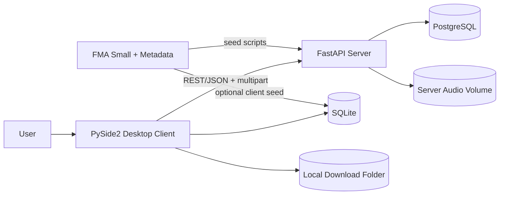
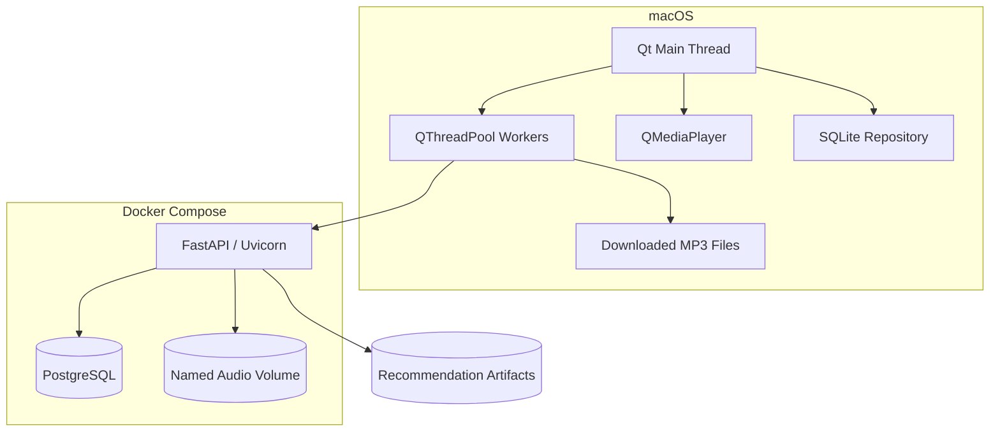
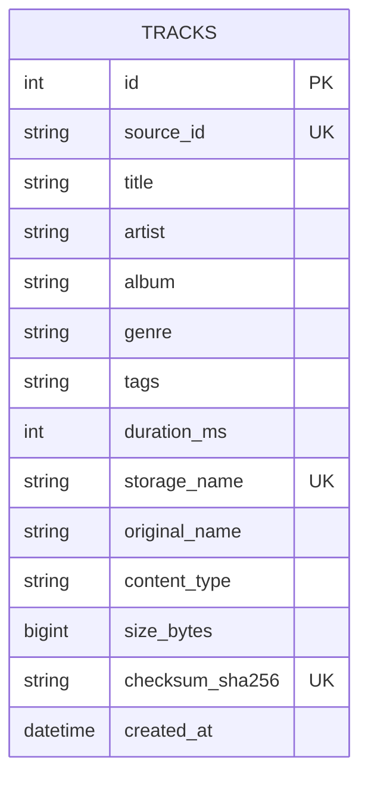
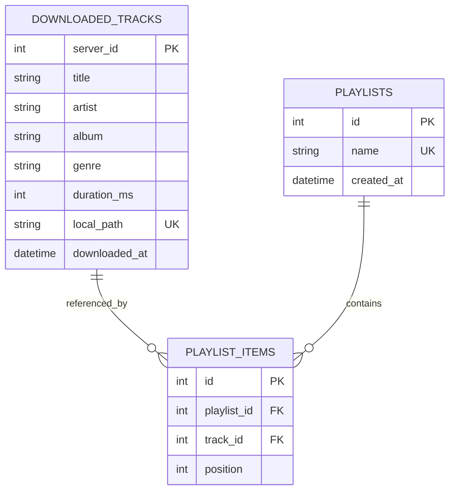
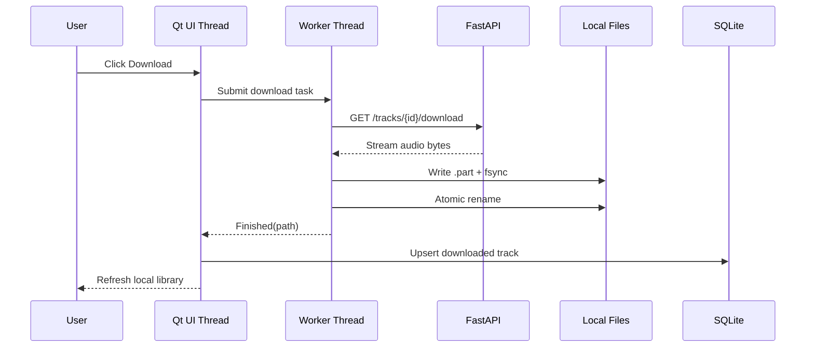
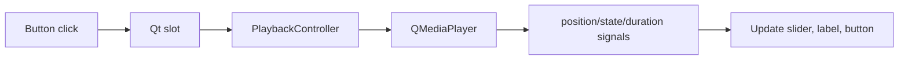
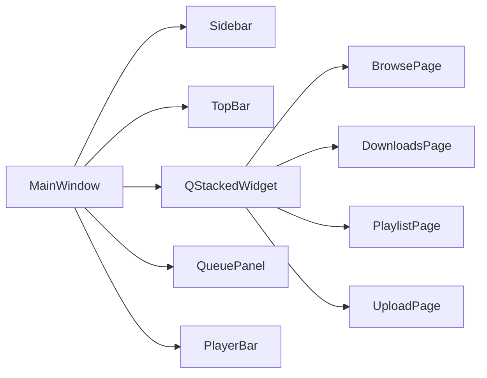
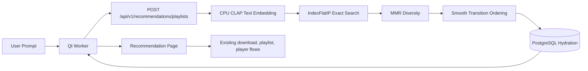
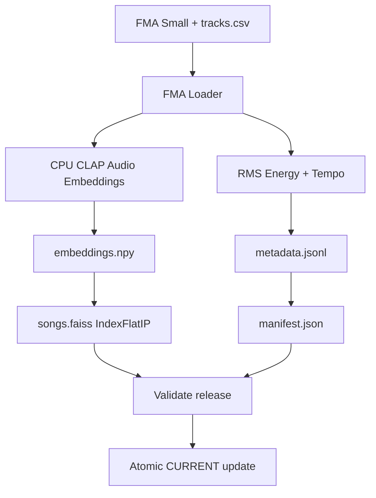
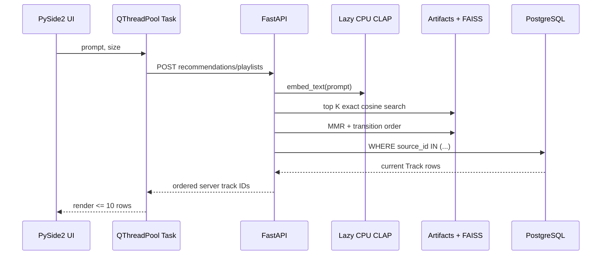

# Design

## Goals

1. Keep the UI event loop free of HTTP, hashing, copying, and database scans.
2. Treat PostgreSQL + server audio volume as the shared source of truth.
3. Treat SQLite + local download folder as durable offline client state.
4. Make every file write crash-safe using `.part` + `fsync` + atomic rename.
5. Handle 8,000 tracks without loading audio bytes or constructing 8,000 widgets at startup.

## Context diagram



## Container diagram



## Server ERD



## Client ERD



## Download sequence



## Playback event flow



## Desktop UI shell

The client presentation layer is organized as a reusable PySide2 shell:



`MainWindow` remains the orchestration boundary. It owns `MusicAPI`, `ClientDB`, `PlaybackController`, `QThreadPool`, navigation state, selected playlist state, and the current playback queue.

Pages and components own presentation only. They emit Qt signals for user intent and do not perform direct HTTP or SQLite business logic.

Large music collections continue to use `QTableView` with `QAbstractTableModel`. The refactor does not create one widget per track and does not load remote artwork at startup.

## Prompt playlist recommendations

Recommendations are an optional server-side feature. The client sends only a prompt
and requested size. CLAP, FAISS, librosa, and PyTorch are never imported by the
client and are loaded lazily by the server only when recommendation artifacts are
configured. The default backend is the larger LAION music-specialized CLAP
checkpoint on CPU. The Hugging Face `laion/clap-htsat-unfused` backend remains an
optional lightweight fallback.

The recommendation boundary keeps PostgreSQL authoritative. Artifact metadata stores
FMA catalog keys such as `123`, resolved at request time as `Track.source_id =
"fma:123"`. The API returns current server track IDs, not artifact row numbers or
filesystem paths.



Offline artifact build:



Runtime request:



Complexity symbols:

- `N`: indexed songs, about 8,000 for FMA Small.
- `D`: CLAP embedding dimension.
- `K`: retrieved candidates, default 50.
- `M`: final playlist size, 5-10.

Exact retrieval is approximately `O(ND)` per prompt. MMR is approximately
`O(K * M * D)` in the straightforward implementation. Greedy transition ordering is
approximately `O(M^2 * D)`. Embedding storage is `O(ND)`. At this scale an
approximate index is unnecessary unless measured evidence shows exact search is too
slow.

MMR uses:

```text
MMR(i) = lambda_mmr * relevance(i)
         - (1 - lambda_mmr) * max_similarity(i, already_selected)
```

Transition ordering uses:

```text
C(a, b) = 0.6 * (1 - cosine(audio_a, audio_b))
        + 0.2 * abs(norm_energy_a - norm_energy_b)
        + 0.2 * abs(norm_tempo_a - norm_tempo_b)
```

Energy and tempo are robust-scaled to `[0, 1]` with neutral imputation for missing
or invalid values. CLAP model loading is process-local, CPU-only, guarded by a
lock, and cached lazily. The artifact manifest records the CLAP backend and model
identifier, and runtime rejects requests when the configured model does not match
the index model because audio and text embeddings must share the same space.
Prompt results use a small bounded LRU cache. Future personalization from user
behavior is intentionally out of scope.

The recommended evaluator setup uses:

```text
Backend: laion
Model: HTSAT-base + music_audioset_epoch_15_esc_90.14.pt
Device: CPU
Audio embedding: offline index command
Text embedding: runtime request
```

This is the heavier infrastructure path: the local checkpoint is about 2.35 GB,
the Docker image needs the optional `laion-clap` stack, and Docker memory must be
large enough to load the model. The benefit is quality: this checkpoint is
music-specialized and gives better prompt relevance for the AI Playlist workflow
than the smaller general-audio Hugging Face model.

The optional Hugging Face setup uses `laion/clap-htsat-unfused`. Its repository is
roughly 618 MB and setup is simpler, but it is a general audio CLAP model; music
recommendation quality for abstract prompts may be weaker. Both backends remain
CPU-only, lazy-loaded server-side, and require rebuilding the FAISS index when
switching models.

Benchmark prompts should include:

- Dreamy electronic music for coding
- Energetic rock for working out
- Calm instrumental music for reading
- Dark experimental music
- Upbeat hip-hop

## API choice

REST is sufficient because the required interactions are request/response operations. JSON is used for catalog metadata; multipart/form-data is used for uploads; `FileResponse` streams downloads. WebSocket or SSE would add lifecycle and reconnection complexity without a real-time requirement.

## Non-functional design

- **No freezing:** network and file transfer work runs in `QThreadPool` tasks.
- **Startup:** SQLite schema creation is constant-size; catalog loading is asynchronous and limited to 500 rows in this starter.
- **Hard-kill persistence:** PostgreSQL named volume, SQLite WAL, atomic file replacement.
- **Memory:** audio is streamed in chunks; rows use a model/view table instead of one widget per track.
- **Stable resources:** each HTTP and SQLite connection uses a context manager.

## Production extensions

- Alembic migrations instead of `create_all`.
- Server-side cursor pagination and genre indexes based on measured queries.
- Cover-art thumbnail cache with bounded LRU.
- Retry/cancel controls in worker tasks.
- Checksums on client downloads.
- Prometheus metrics or structured performance logs.
