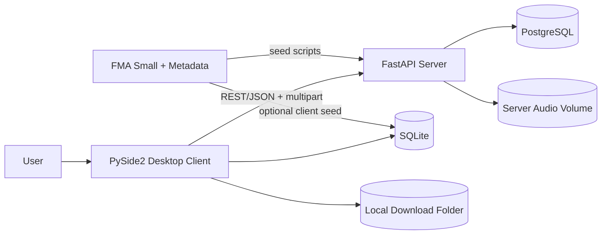
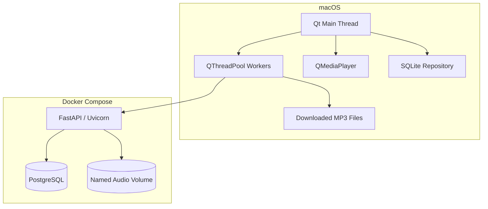
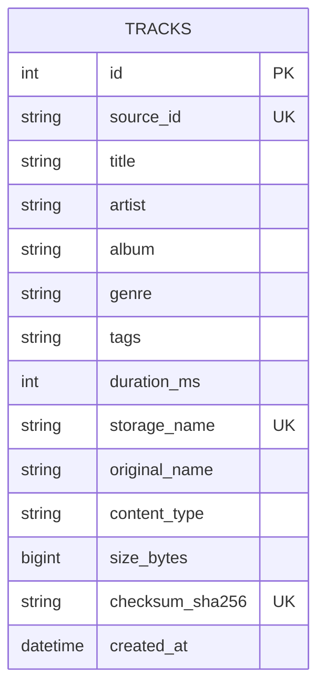
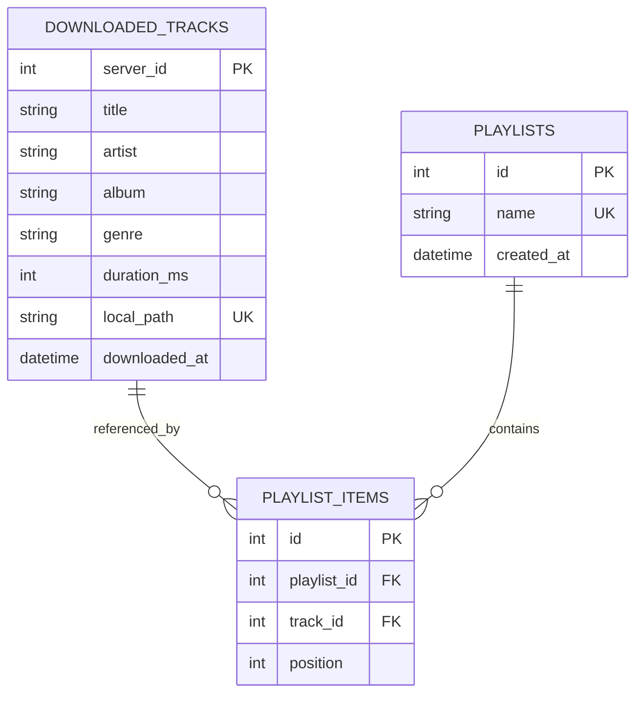
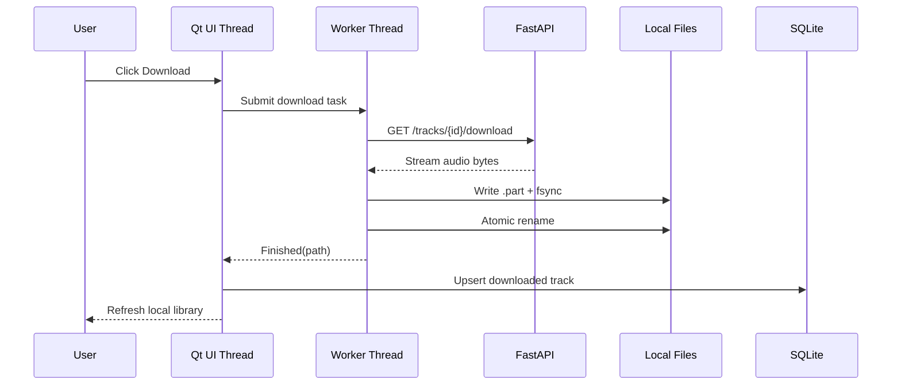
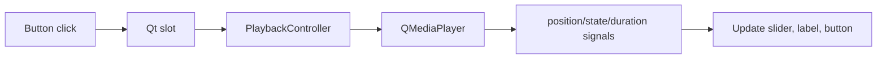
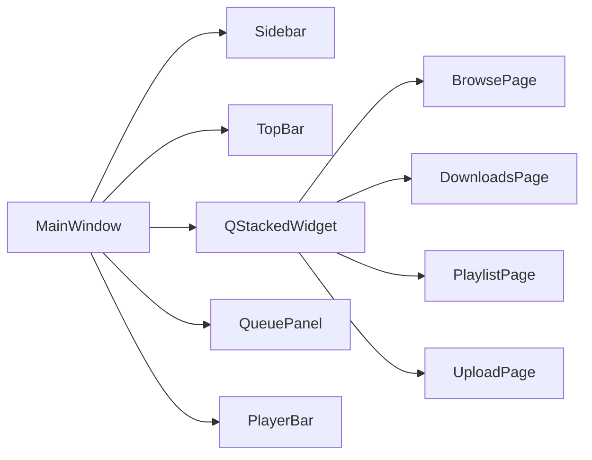

# Design

## Goals

1. Keep the UI event loop free of HTTP, hashing, copying, and database scans.
2. Treat PostgreSQL + server audio volume as the shared source of truth.
3. Treat SQLite + local download folder as durable offline client state.
4. Make every file write crash-safe using `.part` + `fsync` + atomic rename.
5. Handle 8,000 tracks without loading audio bytes or constructing 8,000 widgets at startup.

## Context diagram

## Container diagram

## Server ERD

## Client ERD

## Download sequence

## Playback event flow

## Desktop UI shell

The client presentation layer is organized as a reusable PySide2 shell:

`MainWindow` remains the orchestration boundary. It owns `MusicAPI`, `ClientDB`, `PlaybackController`, `QThreadPool`, navigation state, selected playlist state, and the current playback queue.

Pages and components own presentation only. They emit Qt signals for user intent and do not perform direct HTTP or SQLite business logic.

Large music collections continue to use `QTableView` with `QAbstractTableModel`. The refactor does not create one widget per track and does not load remote artwork at startup.

## API choice

REST is sufficient because the required interactions are request/response operations. JSON is used for catalog metadata; multipart/form-data is used for uploads; `FileResponse` streams downloads. WebSocket or SSE would add lifecycle and reconnection complexity without a real-time requirement.

## Non-functional design

- **No freezing:** network and file transfer work runs in `QThreadPool` tasks.
- **Startup:** SQLite schema creation is constant-size; catalog loading is asynchronous and limited to 500 rows in this starter.
- **Hard-kill persistence:** PostgreSQL named volume, SQLite WAL, atomic file replacement.
- **Memory:** audio is streamed in chunks; rows use a model/view table instead of one widget per track.
- **Stable resources:** each HTTP and SQLite connection uses a context manager.

## Production extensions

- Alembic migrations instead of `create_all`.
- Server-side cursor pagination and genre indexes based on measured queries.
- Cover-art thumbnail cache with bounded LRU.
- Retry/cancel controls in worker tasks.
- Checksums on client downloads.
- Prometheus metrics or structured performance logs.
